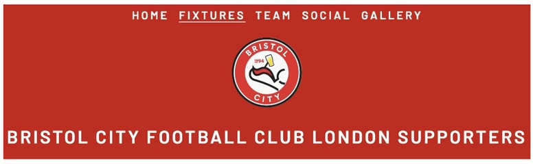
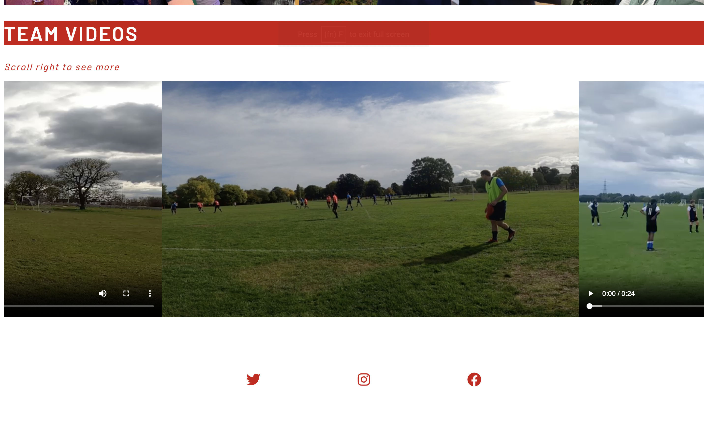

# BCFCLS
The BCFCLS website is a site that hopes to keep the 'Bristol City Football Club London Supporters' team up to date with their upcoming season agenda, fixtures, league standing and social media. 
The site's main target market group are the BCFCLS players: male, mid 20s- mid-30s. The user would use this site to keep up to date with upcoming fixtures, status in the premier league verusus other football clubs, see new posts for social events, review the gallery and so forth. A user would predominantly revist the site to see the next fixtures, skim the updates on the club's status in the central premier league, and keep an ear out for any mentions in the highlighhts from last week. 
The site is also targeted to the club fans and prospective recruits who are looking for updates on previous matches, how to get to their next home ground game, and upcoming socials they may wish to join with the players. Users can also stay up to date with the team's social media and see a gallery of match videos and images. 

# Features
The BCFCLS wesbite includes a home page with season updates and several other pages including fixtures, team information, social events and a gallery. 

## Existing Pages & Features

### Navigation Bar

Featured on all five pages, the fully responsive navigation bar includes links to the Logo, Home page, Fixtures, Team, Social and Gallery. This is position in the bar at the top of the page and easily displayed in a red panel containing the logo and navigation bar. It is identical in each page.
This section will allow the user to easily navigate from page to page across all devices without having to revert back to the previous page via the ‘back’ button.

### Footer
Featured on all five pages, the footer contains social icons with links to the team's Twitter, Instagram and Facebook sites. It is identical in each page for continuity and familiarity to connecting sites.

### Home page features 
1. Landing image:
The landing image includes a photograph to define the sense of community and identfity the team as soon as the user accesses the site. 
2. BCFCLS History:
This text gives a breif synopsys of the foundation of the team. This allows the user to learn the background and orgin of the team. 
3. Season Update:
This section addresses the upcoming season and gives notice to fees and expectations. This provides the user with information to pay for their season position on the team via bank details and gives notice to the team protocol. 

### Fixtures features
1. Latest Results table:
This table provides the user information on the live results, contatining the last 4 results from previous games. This means the user can stay updated on previous wins, losses or draws.
2. Upcoming fixtures table:
This table lists the upcoming matches to notify the user of the next game. Users may be either a player or observerer, and therefore this updates the user on how to attend/ participate based on venue, timing and location. 
3. Central League table:
This table groups all teams in the Central London Premier League. This will tell the user what postion BCFCLS current sit at, should they be interested to track the league standings. This also tells the user of competitiors standings. 
4. Map of the home ground:
This feautres displays the address and google map to the home ground. This will guide all users to the location of their majority matches. User can play around with the map on the page to see nearby how to access the park or for shps, resturants, public transport links. 
5. Photo of the boys at the goal:
Displays an image from a recent match to insprire all users, players or observers. 

### Team features
1. Players and their poitions table:
This table displays all player names and their postion. This means the user can look up any team player. For example: player A's wife may wish to use the website to find out what postion player A plays. 
2. Fantasy Rules 23/24: 
This feaure displays two tables - match points and bonus points. The user can identify which points they will be allocated and which actions will earn them extra points towards the team's fantasy team. 
3. Player of the match:
This feature identifies the latest player of the match. This encourages users to click  on the team page to see updates from the prevous game. A user may be an assigned player that dd not play the previou week and would like to catch up on the highlights.
4. Latest match highlights:
This feature lists several points of reference from the previous match. 
5. Quotes from team Mascot, a Get Well Soon and Captain and Manager:
This featured diplays images and quotes from team members and creates a sense of community. The user can sense what kid of football tram this is from reading the quotes and seeing photos of the team. 

### Social features 
1. List of upcoming events:
This lists any upcoming social events hosted by the team. This encourages the user to get involved, player or observer. 
2. Photo of the team on a previous social:
Image supports the list of upcoming events and tells the user there have been previous events before. 
3. Twitter feed:
This feature updates the user with regular twitter comments. Twitter is the most used social media for BCFCLS and as with most sports fan clubs, provides real time updates, news and asks for the team. This fautre enables the user can stay connected to the BCFCLS team twitter, without leaving the site. 

### Gallery features
1. Lists all photos:
Here the user can see all team asscoaited photos. There is not currently one page on any social media platform that can group all images together in a gallery. This means the user can browse all images at once. 
2. List all videos:
Here the user can see all team asscoaited videos, including previous match snippets. There is not currently one page on any social media platform that can group all videos together in a gallery. This means the user can browse all videos at once. 

## Stand Out Features 

### Tables 
- All tables are media responsive, and have a scroll bar in order to allow the user to access the information without looking font size for smaller screen accessibilty. All tables will be updated with each week match information. Some tables have borders that sit beside other tables and do no interact with each other accross various screen sizes. There is a light red/ pink highlight for the table row as the user hover, in order to make this specific data set stand out to the user. 

### Gallery
- All images are stored to the right as you scroll. Each week the team manager will update with more images to add, at which we will add captions. 
- All videos are stored with a select play/ pause/ stop. 
 

### Features left to implement
1. Team feedback form:
Allowing the user to put forward comments to the Captain and Manager about player tactics, season schedule, events, and so forth. 
2. Javascript link to pay for the season team placement fee.

### Validator Testing 
## HTML
  - No errors were returned when passing the index.html through the official [W3C validator](https://validator.w3.org/nu/?showsource=yes&doc=https%3A%2F%2F8000-jodiehillki-project1bcf-tq9a2fe5a8y.ws-eu98.gitpod.io%2Findex.html#textarea1)
  - No errors were returned when passing the fixtures.html through the official [W3C validator](https://validator.w3.org/nu/?showsource=yes&doc=https%3A%2F%2F8000-jodiehillki-project1bcf-tq9a2fe5a8y.ws-eu98.gitpod.io%2Findex.html#textarea1)
  - No errors were returned when passing the team.html through the official [W3C validator](https://validator.w3.org/nu/?showsource=yes&doc=https%3A%2F%2F8000-jodiehillki-project1bcf-tq9a2fe5a8y.ws-eu98.gitpod.io%2Findex.html#textarea1)
  - No errors were returned when passing the social.html through the official [W3C validator](https://validator.w3.org/nu/?showsource=yes&doc=https%3A%2F%2F8000-jodiehillki-project1bcf-tq9a2fe5a8y.ws-eu98.gitpod.io%2Findex.html#textarea1)
  - No errors were returned when passing the gallery.html through the official [W3C validator](https://validator.w3.org/nu/?showsource=yes&doc=https%3A%2F%2F8000-jodiehillki-project1bcf-tq9a2fe5a8y.ws-eu98.gitpod.io%2Findex.html#textarea1)
  

## CSS
  - No errors were found when passing through the ccs official Jigsaw Validator. This document validates as CSS level 3 + SVG. [(Jigsaw) validator](https://jigsaw.w3.org/css-validator/validator?uri=https%3A%2F%2F8000-jodiehillki-project1bcf-tq9a2fe5a8y.ws-eu98.gitpod.io%2Fteam.html&profile=css3svg&usermedium=all&warning=1&vextwarning=&lang=en)

## Code Testing
  - Nav Bar: All navigation links take to the corresponding page. The main logo image on each page links to the home page. 
  - Footer: All footer links open in a new tab for each social media site. NB: User has to be logged in to the social media platform to access the information, as per any social media site. 
  - Fixtures - Map Link: Google maps on the fixtures page displays the home ground site, if the user clicks 'view on a larger map' this opens in a new tab. 
  - Social - Twitter Link: Twitter timeline and the 'follow @' button both open in a new tab, directly to the teams twitter page. 
  - Social - Event link to map page: Event box suggests a link to the fixtures page where the map is. 

## Media Response 
  - Pages are designed to adjust items in to a column and centrally read as media devices get smaller.
  - Logo and menu text adjusts dependant on the screen size. 
  - Maps, all tables, and main images all re-size depandant on the screen. 
  - Borders and divs have been placed not to over spill. 
  Examples:
  # iPhone11 View - Home
  
  # iPhone11 View - Fixtures
   
  # iPad Mini View - Tables
   
  # iPad Mini View - Team Mentions
  
  # Samsung Galaxy 8 View - Gallery
  

### Unfixed / Solved Bugs 
- Logo and h1 in the .header would not display side by side without an imposed margin, the design did not fit well. Instead, the logo and h1 are positioned parralel and central to keep the design fluid independant of the screen size. 
- Hero Image did not suit to cover screen as a background due to the image quality. Instead, the hero image has been set to fill and image rendering; auto. This is a much clear picture. 

## Deployment

This section should describe the process you went through to deploy the project to a hosting platform (e.g. GitHub) 

- The site was deployed to GitHub pages. The steps to deploy are as follows: 
  - In the GitHub repository, navigate to the Settings tab 
  - From the source section drop-down menu, select the Master Branch
  - Once the master branch has been selected, the page will be automatically refreshed with a detailed ribbon display to indicate the successful deployment. 

The live link can be found here - insert link.

## Credits 

In this section you need to reference where you got your content, media and extra help from. It is common practice to use code from other repositories and tutorials, however, it is important to be very specific about these sources to avoid plagiarism. 

You can break the credits section up into Content and Media, depending on what you have included in your project. 

### Content 

- All table content taken from [FA Social](https://fulltime.thefa.com/displayTeam.html?id=431724151)
- The icons in the footer and team.html were taken from [Font Awesome](https://fontawesome.com/)

### Media

- Images and videos sourced directly from the BCFCLS team Manager and Captain. All photos and videos taken on personal media devices and uploaded.
- Logo Image sourced from [BCFC_fans_fc Twitter](https://twitter.com/bcfc_fans_fc)
